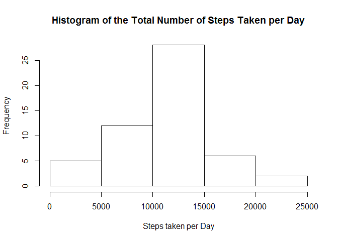
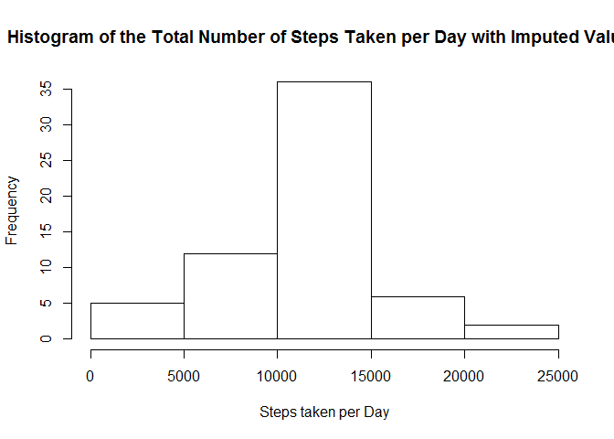

# Reproducible Research: Peer Assessment 1


## Loading and preprocessing the data

This part of R code is used to load the data into data frame called "activity". Also, the date variable was changed to date type.


```r
localData <- "activity.csv"
if (!file.exists(localData)) {
    unzip("activity.zip")
}
activity <- read.csv("activity.csv")
activity$date <- as.Date(activity$date)
```

## What is mean total number of steps taken per day?


```r
stepsPerDay <- aggregate(steps ~ date, data=activity , FUN=sum, na.rm=TRUE)
hist(stepsPerDay$steps, main="Histogram of the Total Number of Steps Taken per Day", xlab="Steps taken per Day")
```

 

The mean of the total number of steps taken per day:

```r
mean(stepsPerDay$steps)
```

```
## [1] 10766.19
```

The meadian is of the total number of steps taken per day:

```r
median(stepsPerDay$steps)
```

```
## [1] 10765
```

## What is the average daily activity pattern?


```r
dailyActivityPattern <- aggregate(steps ~ interval, data=activity, FUN=mean, na.rm=TRUE)
with(dailyActivityPattern, plot(interval, steps, type = "l"))
```

 


```r
k <- which.max(dailyActivityPattern$steps)
maxSteps <- dailyActivityPattern[k,1]
```

The interval 835 contains the maximum number of steps.

## Imputing missing values


```r
missingValues <- sum(is.na(activity$steps))
```

The total number of missing values in the dataset is 2304.

We are going to fill in all of the missing values in the dataset with the mean for that 5-minute interval and save it in a new dataset "activityImputed".


```r
activityImputed <- activity
for (i in 1:nrow(activityImputed)) {
    if(is.na(activityImputed$steps[i])) {
    j <- which(activityImputed$interval[i] == dailyActivityPattern$interval)
    activityImputed$steps[i] <- dailyActivityPattern$steps[j]
    }
}
```

Histogram of the total number of steps taken each day from the imputed dataset:

```r
stepsPerDayImputed <- aggregate(steps ~ date, data=activityImputed , FUN=sum, na.rm=TRUE)
hist(stepsPerDayImputed$steps, main="Histogram of the Total Number of Steps Taken per Day with Imputed Values", xlab="Steps taken per Day")
```

 

The mean of the total number of steps taken per day from the imputed dataset:

```r
mean(stepsPerDayImputed$steps)
```

```
## [1] 10766.19
```

The meadian is of the total number of steps taken per day from the imputed dataset:

```r
median(stepsPerDayImputed$steps)
```

```
## [1] 10766.19
```

These mean and median are almost the same as the estimates from the first part of the assignment. There is little impact of imputing missing data on the estimates of the total daily number of steps.

## Are there differences in activity patterns between weekdays and weekends?

New factor variable weekdayOrWeekend in the dataset has two levels - "weekday" and "weekend" indicating whether a given date is a weekday or weekend day.


```r
activityImputed$weekdayOrWeekend <- weekdays(activityImputed$date)
for (i in 1:nrow(activityImputed)) {
    if (activityImputed$weekdayOrWeekend[i] == "Monday"|activityImputed$weekdayOrWeekend[i] == "Tuesday"|activityImputed$weekdayOrWeekend[i] == "Wednesday"|activityImputed$weekdayOrWeekend[i] == "Thursday"|activityImputed$weekdayOrWeekend[i] == "Friday") activityImputed$weekdayOrWeekend[i] <- "weekday"
    if (activityImputed$weekdayOrWeekend[i] == "Saturday"|activityImputed$weekdayOrWeekend[i] == "Sunday") activityImputed$weekdayOrWeekend[i] <- "weekend"
}
```

Below is a panel plot containing a time series plot of the 5-minute interval and the average number of steps taken, averaged across all weekday days or weekend days:


```r
library(lattice)
dailyActivityPatternImputed <- aggregate(steps ~ interval + weekdayOrWeekend, data=activityImputed, FUN=mean, na.rm=TRUE)
xyplot(steps ~ interval | weekdayOrWeekend, data = dailyActivityPatternImputed, layout = c(1,2), type = "l", xlab = "Interval", ylab = "Number of steps")
```

 
